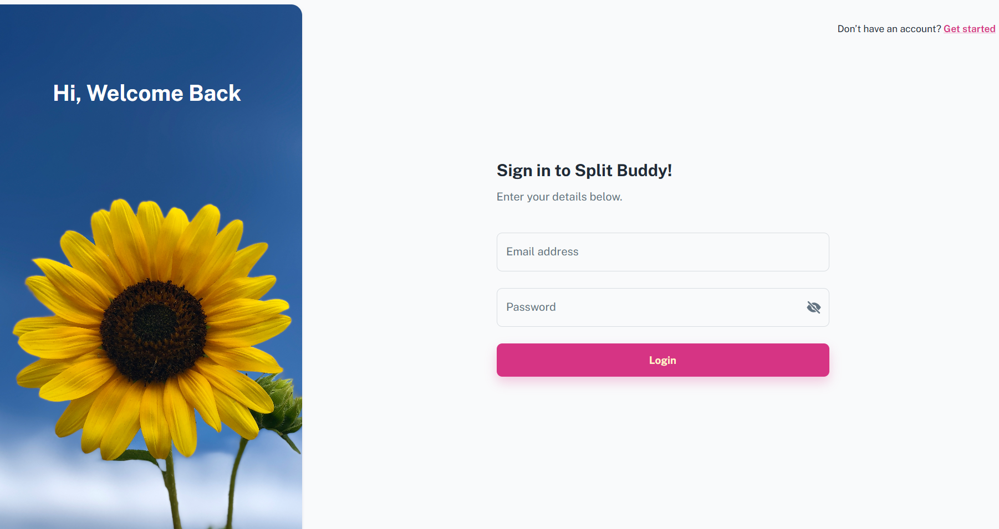
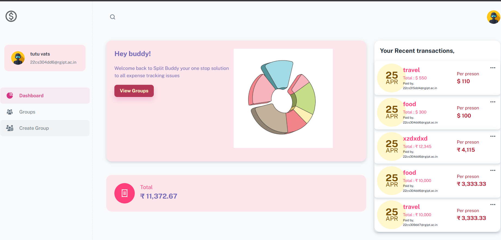

# 💸 Expense Tracker

An advanced full-stack expense tracker that helps users manage and settle group expenses efficiently. The application computes net balances, minimizes the number of transactions, and provides a clean interface to visualize who owes whom.

---

## 📁 Project Structure

- **Frontend**: Built using React and Material-UI (MUI)
- **Backend**: Node.js + Express
- **Database**: MongoDB
- **Authentication**: JWT + bcrypt

---
## 🖼️ Project Screenshots

> Below are some UI snapshots of the Expense Tracker. All images are stored in the `/screenshots` folder.

### 📌 Sign Up Page


### 📌 Sign In Page


### 📌 Dashboard


### 📌 All Groups View


### 📌 Create Group


### 📌 Group Expense View


### 📌 Expense Details


### 📌 Group Balance


## 🧠 Algorithm for Expense Simplification

This project uses a smart algorithm to **minimize the number of transactions** needed to settle debts among a group of people.

### 📌 Step-by-Step Approach:

1. **Calculate Net Amount**:  
   For each person, compute the net amount by subtracting the total amount they gave from the amount they spent.

2. **Group People**:
   - Creditors: People who should receive money.
   - Debtors: People who owe money.

3. **Sort Groups**:  
   Use priority queues to sort both groups in descending order based on their amounts.

4. **Match Transactions**:  
   Match the highest debtor with the highest creditor and record the transaction.

5. **Minimize Transactions**:  
   The algorithm continues recursively until all debts are settled, ensuring the number of transactions is as small as possible.

---
## ⚙️ Installation & Setup

### ✅ 1. Clone the Repository

```bash
git clone https://github.com/Raksha-Vats/expense-tracker.git
cd expense-tracker
```

---

### ✅ 2. Backend Setup

#### 📁 Navigate to backend folder:
```bash
cd backend
```

#### 📦 Initialize npm:
```bash
npm init -y
```

#### 📥 Install dependencies one by one:

```bash
npm install express          # Web framework
npm install mongoose         # MongoDB object modeling
npm install dotenv           # Load environment variables
npm install bcryptjs         # Password hashing
npm install jsonwebtoken     # JWT authentication
npm install cookie-parser    # Parse cookies from requests
npm install cors             # Enable CORS (Cross-Origin Requests)
npm install winston          # Logging
npm install morgan           # HTTP request logger
npm install http-errors      # Create and handle HTTP errors
npm install zod              # Schema validation
```

---

### ✅ 3. Frontend Setup

#### 📁 Navigate to frontend folder:
```bash
cd ../frontend
```

#### 📦 Initialize npm:
```bash
npm init -y
```

#### 📥 Install dependencies:

```bash
npm install react                     # React core
npm install @mui/x-data-grid          # MUI Data Grid UI component
npm install concurrently              # Run backend & frontend together
```

---

### ✅ 4. Environment Setup

Create a `.env` file in the `backend/` folder with the following content:

```env
PORT=5000
MONGODB_URI=mongodb://localhost:27017/expense-tracker
JWT_SECRET=your_secret_key
```

---
